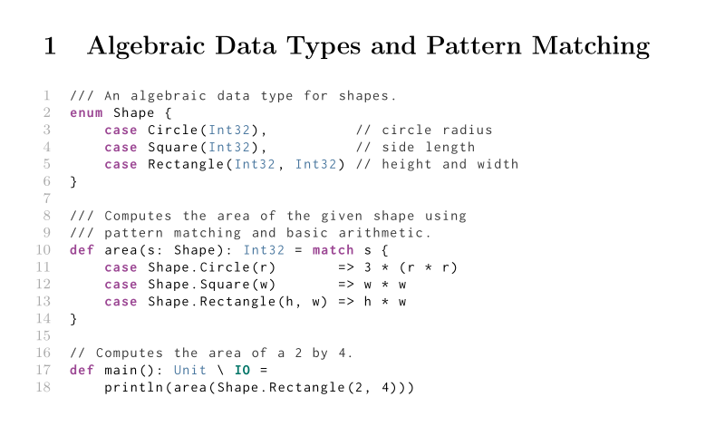

# Flix Listings Package

Syntax highlighting for [Flix](https://flix.dev/) source code in LaTeX using
the `listings` package.



## Installation

Download the latest [flix.sty](flix.sty) and place it next to your LaTeX
document or in your local TeX tree. Then load the package in your preamble:

```latex
\usepackage{flix}
```

The package requires `listings` and `xcolor`, which it loads automatically.

## Usage

### Packaged Style

Select `style=flix` to use the supplied syntax highlighting, colors, line
numbers, and line wrapping:

```latex
\usepackage{flix}

\lstset{style=flix}

\begin{lstlisting}
def main(): Unit \ IO =
    println("Hello, world!")
\end{lstlisting}
```

The style can also be selected for an individual listing:

```latex
\begin{lstlisting}[style=flix]
enum Shape {
    case Circle(Int32)
    case Rectangle(Int32, Int32)
}
\end{lstlisting}
```

### Syntax Only

Select `language=flix` instead when you want Flix syntax recognition with your
own presentation settings:

```latex
\lstset{
  language=flix,
  basicstyle=\ttfamily\small,
  keywordstyle=\bfseries,
  numbers=none
}
```

### Customization

Options specified after `style=flix` override the packaged defaults:

```latex
\lstset{
  style=flix,
  basicstyle=\ttfamily\small,
  numbers=none
}
```

The package colors are named `flix-code-color`, `flix-keyword-color`,
`flix-effect-keyword-color`, `flix-type-color`, `flix-comment-color`,
`flix-string-color`, and `flix-linenumber-color`.

## Example

See [example.tex](example.tex) for a complete document. Compile it with:

```console
pdflatex example.tex
```

## License

This project is available under the [Apache License 2.0](LICENSE.md).
